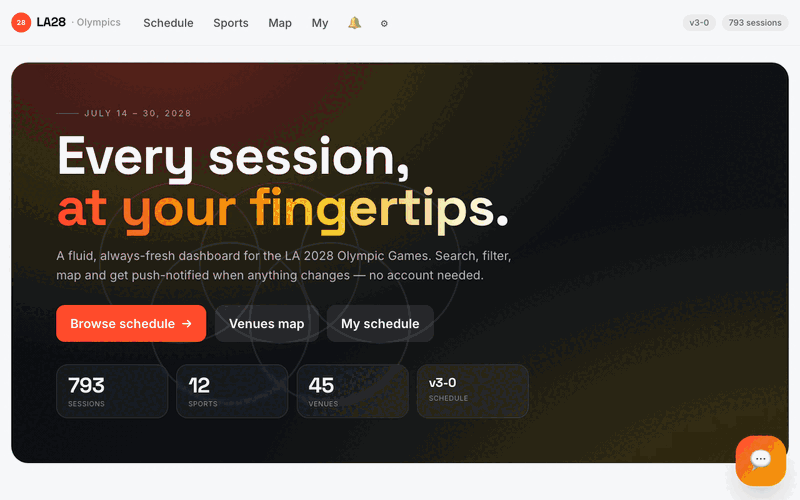

# LA28 Olympics Schedule Dashboard 🏅

A fluid, open-source dashboard for the **2028 Los Angeles Olympic Games** schedule. Search, filter, map, and get notified about every session across 58 sports and 47 venues — powered by community-contributed AI.

> **The problem:** The official [la28.org schedule](https://la28.org/en/games-plan/olympics.html) publishes PDFs you can't search, filter, or subscribe to. We fix that.

   

<p align="center">
  
</p>

---

## Features

- **793+ sessions** parsed from official la28.org PDFs, refreshed daily
- **Full-text search** across sports, events, venues
- **Interactive venue map** (MapLibre GL) — filter by sport or venue, 46 geolocated pins
- **AI Concierge** 💬 — ask questions, get recommendations, star events via chat
- **Voice input** 🎙 — speak your queries (Web Speech API, zero cost)
- **My Schedule** — star sessions, view as timeline, export to `.ics` (Apple Cal / Google Cal)
- **Push notifications** — follow sports, get alerted on schedule changes
- **Timeline view** — day-column visualization, horizontally scrollable
- **Responsive + fluid** — scales from mobile to ultrawide

---

## Quick Start

```bash
git clone https://github.com/conatarun/LAO28.git
cd LAO28
npm install
npm run dev
```

Open **http://localhost:5173** — schedule data auto-ingests on first boot.

---

## Getting Started (Step by Step)

### Prerequisites
- **Node.js 20+** ([download](https://nodejs.org))
- **npm** (comes with Node)
- A terminal (macOS Terminal, VS Code, iTerm, etc.)

### 1. Clone and install

```bash
git clone https://github.com/conatarun/LAO28.git
cd LAO28
npm install
```

### 2. Start the dev server

```bash
npm run dev
```

This starts both:
- **Client** on http://localhost:5173 (Vite + React)
- **Server** on http://localhost:3000 (Fastify API)

### 3. Database auto-populates

On first boot, the server:
1. Creates `data/olympics.db` (SQLite)
2. Sets up all tables (sessions, venues, notifications, etc.)
3. Fetches the 3 schedule PDFs from la28.org (~2MB total)
4. Parses the "By Event" PDF → inserts **793 sessions** across 58 sports
5. Geolocates 46 venues from the bundled coordinates file

This takes **~3-5 seconds**. Watch the terminal — you'll see:
```
startup refresh done { ok: true, pdfs_downloaded: 3, sessions_parsed: 793 }
```

### 4. Open the dashboard

Go to **http://localhost:5173** — you should see the full schedule, map, sports, everything.

### 5. (Optional) Add an AI key for the chatbot

Without an API key, the 💬 concierge shows quick-start wizard buttons (free, no AI). Add a key to enable the full AI chat:

---

## Add Your AI API Key (Help Improve the Chatbot!)

The AI concierge works with **free** models out of the box. But you can plug in your own API key to improve quality, try different models, and help us benchmark what works best for Olympic schedule guidance.

### Option 1: OpenRouter (free signup, many models)

1. Go to [openrouter.ai](https://openrouter.ai) → sign in with Google
2. **Keys** → Create Key → copy it
3. Add to `.env`:
   ```
   OPENROUTER_KEY=sk-or-your-key-here
   ```
4. Restart: `npm run dev`

Free models available: Llama 3.3 70B, Nvidia Nemotron 120B, Gemma 3 27B, and more.

### Option 2: Anthropic (Claude Haiku — best tool use)

1. Go to [console.anthropic.com](https://console.anthropic.com) → add $10 credit
2. Create API key
3. Add to `.env`:
   ```
   ANTHROPIC_API_KEY=sk-ant-your-key-here
   ```

### Option 3: Groq (free, fast inference)

1. Go to [console.groq.com](https://console.groq.com) → sign in
2. Create API key
3. Add to `.env`:
   ```
   GROQ_API_KEY=gsk_your-key-here
   ```

> **Contributing model configs:** If you find a model that works particularly well, open a PR adding it to the rotation in `server/src/chat.ts`. We want to crowdsource the best free/cheap model for Olympic schedule Q&A.

---

## Architecture

```
┌─────────────────────────────────────────────────────┐
│  Client (Vite + React + TypeScript + Tailwind)      │
│  MapLibre GL · Web Push · Web Speech API · Stars    │
└────────────────────────┬────────────────────────────┘
                         │ /api/*
┌────────────────────────▼────────────────────────────┐
│  Server (Fastify + Node.js)                         │
│  Routes · Chat (OpenRouter) · Push (VAPID)          │
│  Ingest Pipeline (PDF parse → SQLite → diff → notify)│
└────────────────────────┬────────────────────────────┘
                         │
┌────────────────────────▼────────────────────────────┐
│  SQLite (WAL mode)                                  │
│  sessions · venues · notifications · chat_cache     │
│  FTS5 full-text search                              │
└─────────────────────────────────────────────────────┘
                         ▲
                         │ Daily cron 07:00 UTC
┌────────────────────────┴────────────────────────────┐
│  la28.org PDFs (By Event v3.0)                      │
│  793 sessions · 58 sports · 47 venues               │
└─────────────────────────────────────────────────────┘
```

---

## Scripts

| Command | Description |
|---|---|
| `npm run dev` | Start client (:5173) + server (:3000) with hot reload |
| `npm run build` | Production build (Vite → dist/) |
| `npm start` | Production server (serves dist/ + API) |
| `npm run ingest:now` | Manually trigger PDF ingest |
| `npm run typecheck` | TypeScript check (strict mode) |

---

## Environment Variables

Create a `.env` file in the project root:

```env
# AI Chat (pick one or more — they fall back in order)
OPENROUTER_KEY=sk-or-...          # Free models via openrouter.ai
ANTHROPIC_API_KEY=sk-ant-...      # Claude Haiku (paid, best quality)
GROQ_API_KEY=gsk_...              # Groq free tier (Llama 3.3 70B)

# Push (auto-generated on first boot if not set)
VAPID_PUBLIC_KEY=
VAPID_PRIVATE_KEY=
VAPID_SUBJECT=mailto:you@example.com

# Server
PORT=3000
HOST=0.0.0.0
DATA_DIR=./data
```

---

## Contributing

We welcome contributions! Areas where help is especially valuable:

### 🤖 AI Model Quality
- Try different models via OpenRouter and report which gives best schedule guidance
- Improve the system prompt in `server/src/chat.ts`
- Add response quality benchmarks

### 📊 PDF Parser
- The parser (`server/src/ingest/parse.ts`) is heuristic — it may break on future PDF versions
- Help make it more robust to layout changes

### 🗺 Venue Data
- Verify/correct venue coordinates in `server/data/venue-coords.json`
- Add missing venues as la28.org announces them

### 🎨 UI/UX
- Improve mobile experience
- Add dark mode
- Better timeline/calendar visualization

### 🔔 Integrations
- Telegram bot
- Discord bot
- Calendar sync improvements

---

## Tech Stack

| Layer | Tech |
|---|---|
| Frontend | React 18, TypeScript, Tailwind CSS, MapLibre GL |
| Backend | Fastify 4, Node.js, tsx |
| Database | SQLite (better-sqlite3, WAL mode, FTS5) |
| AI | OpenRouter (Llama 3.3 70B free), fallback chain |
| Voice | Web Speech API (browser-native) |
| Push | web-push (VAPID) |
| PDF | pdf-parse |
| Deploy | Replit (Reserved VM) |

---

## License

MIT

---

## Disclaimer

This project is not affiliated with, endorsed by, or connected to the LA28 Organizing Committee, the International Olympic Committee, or any official Olympic body. Schedule data is sourced from publicly available PDFs on la28.org.
